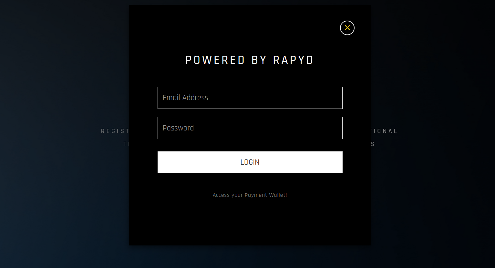
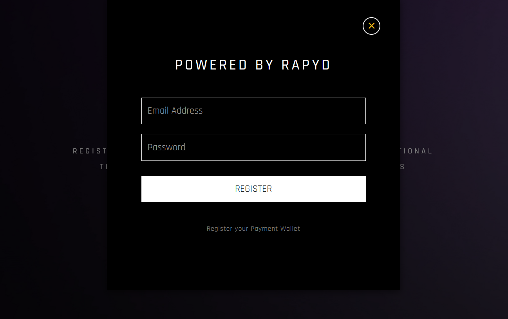
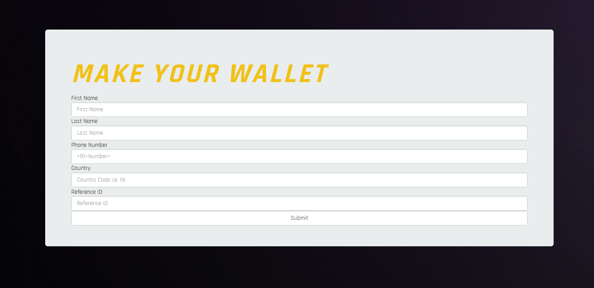
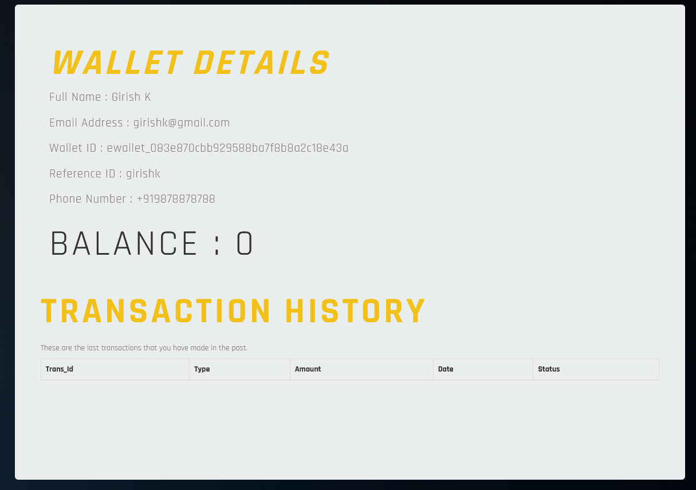
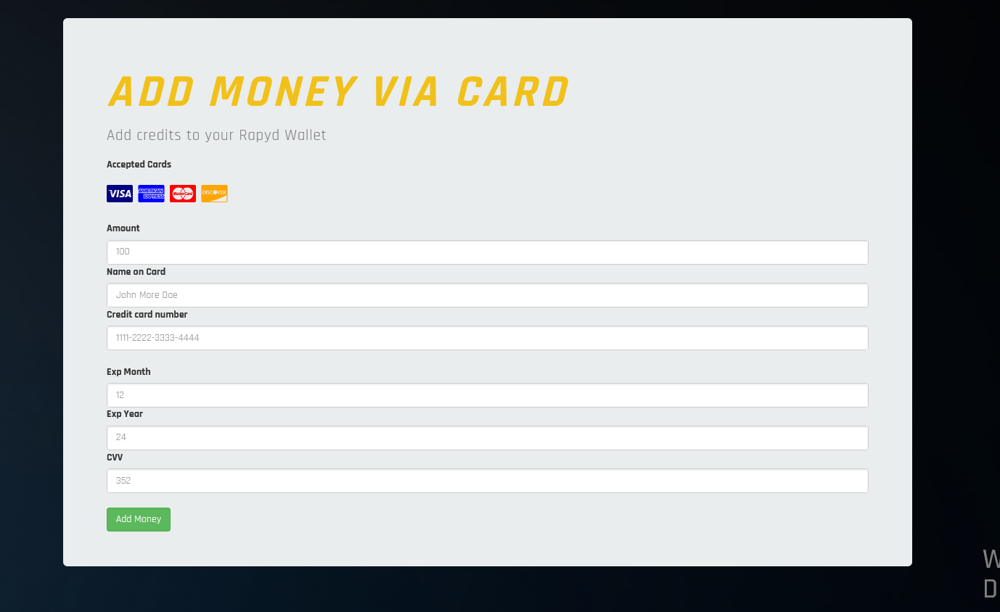
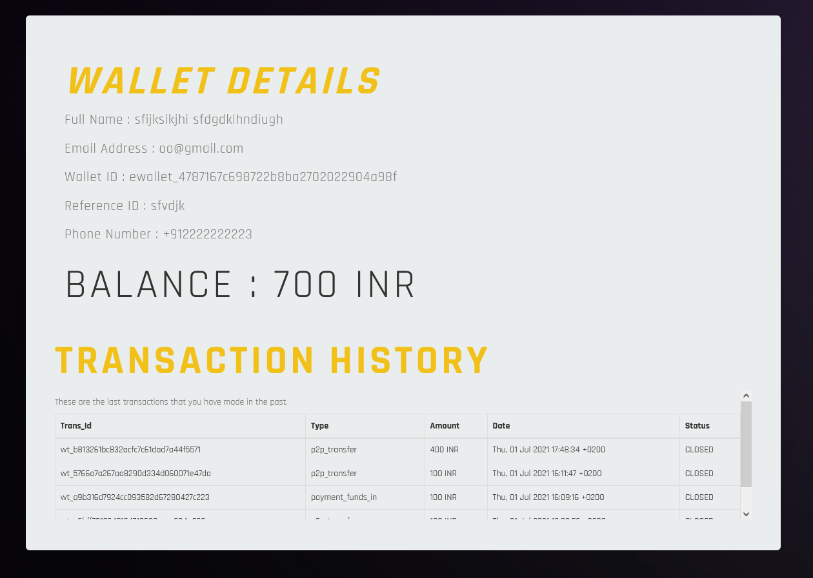

# RAPYD-PAY

Reference : [Rapyd Docs](https://docs.rapyd.net/build-with-rapyd/docs/getting-started)

<p align="center">

</p>

### Rapyd-Pay is a minimalist payment wallet platform which allow users to store funds in their rapyd wallets, send and recieve money to other wallets, and track transaction histories.

<p align="center">

</p>

### NOTE: This is a submission for the ``Hackathon : Formula 0001: Rapyd Fintech Grand Prix``. This is not an actual payment wallet webapp.

## Youtube Video Showcase : https://www.youtube.com/watch?v=nawmoDx9gwM

## Hosted at : https://rapyd-pay-in.herokuapp.com/

## Prerequisites and Techstacks used

- PHP Framework with Composer Packages
- Bootstrap and Javascript with CSS
- MySQL Database
- Rapyd API (Rapyd Collect and Rapyd Wallet)
- Rapyd Account for Client Portal with API keys


## Getting Started

These are steps to setup and get the local environment ready for the wallet.

### Installation

1. Clone the repo on your machine
```sh
git clone https://github.com/gk2savage/rapyd-pay
```
2. Install Composer packages
```sh
composer install
```
3. Setup the MySQL database on phpmyadmin or locally with the commands with help of ``database_dw.sql``
4. Host it on Apache with MySQL (phpmyadmin) in XAMPP 


## Usage

Rapyd-Pay is a minimalist payment wallet platform which allow users to store funds in their rapyd wallets, send and recieve money to other wallets, and track transaction histories.
You can sign up and login on the rapyd-pay. New Users registering will need to fill a form to automatically register and e-wallet id for their wallet.

You can store money via Credit cards (visa, mastercard etc.). You can send money to other with their ewallet-id and all the transaction history can be seen.

This is just a basic demo for the hackathon purposes but this can be actually implemented in real-life scenarios with better security, multiple authentications, multiple ways to add money in the wallet like Bank Trasnfers which are already present in Rapyd Wallet and adding new technologies like Crypto to send money from Crypto to wallet and vice versa.


## Rapyd-Pay Workflow

### Login and Sign up

<p align="center">

</p>

<p align="center">

</p>

You can login from the homepage. If you are a new user, you can sign-up. 
Once you are done, you will be directed to the mainpage.

### Main Screen

<p align="center">

</p>

If you are a new user, you can go to ``wallet details`` and fill a form to register your wallet and get ewallet-id.
You need to fill details like your full name, country, phone number and a reference id.

<p align="center">

</p>

Once you submit the form, you will be assigned an ewallet-id which you can use to store funds and send money.
If now you go to ``wallet details``, you will see all details like your phone number, email-id etc.

<p align="center">

</p>

To store funds,you can click on ``Add Money`` and you can fill out your card details and amount which you want to store in wallet.

<p align="center">

</p>

To send money, you can click on ``Send`` and enter ewallet-id and the amount. Once done, the reciever can check his balance in ``wallet details``.

<p align="center">

</p>

All your transaction history can be seen in ``wallet details`` as well.

<p align="center">

</p>

### Author

<a href="https://github.com/gk2savage">  <h4> Girish </h4> </a>

### Contributors

<a href="https://github.com/harshkyo">  <h4> Harshit </h4> </a>
